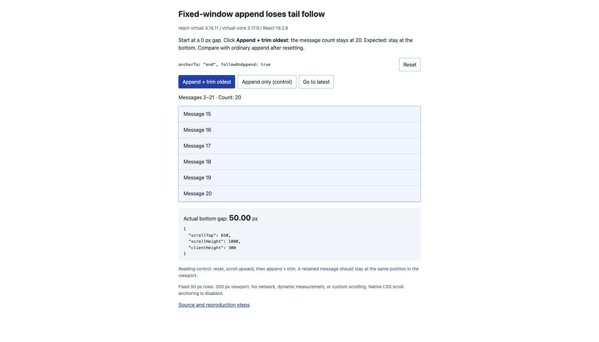

# TanStack Virtual: fixed-window append loses tail follow

[Live reproduction](https://tigerbea.github.io/tanstack-virtual-sliding-window-repro/) · [Edit in StackBlitz](https://stackblitz.com/github/tigerBeA/tanstack-virtual-sliding-window-repro)

A standalone React reproduction using published `@tanstack/react-virtual@3.14.11`, `@tanstack/virtual-core@3.17.9`, and React 19.2.8. Appending a new message while trimming the oldest one keeps the count at 20, but an end-pinned viewport moves away from the bottom despite `followOnAppend: true`.

A [separate cache reproduction](https://tigerbea.github.io/tanstack-virtual-sliding-window-repro/cache.html) uses the same published core with append following disabled. It demonstrates stale item keys and a lost reading anchor when a stable key callback reads updated data.

[Performance measurements for the proposed fix](performance/README.md) document the comparison baseline, resize overhead, browser update and scroll timings, recorded results, and measurement limits.

## Reproduce

1. Open the preview and confirm **Actual bottom gap: 0.00 px**.
2. Click **Append + trim oldest** once. The message IDs change from `[1…20]` to `[2…21]` in one state update.
3. Observe **Actual bottom gap: 50.00 px**. The latest message is below the viewport, although the viewport was previously at the end.
4. Click **Reset** to repeat.

Expected: the viewport stays at the end when new messages are appended, including when old messages are trimmed from the start in the same update.

## Controls

- **Ordinary append:** Reset, then click **Append only (control)**. The count grows from 20 to 21 and the bottom gap stays at 0 px.
- **Reading history:** Reset, scroll upward, then click **Append + trim oldest**. A retained message stays at the same position in the viewport; the user is not pulled to the end.
- **Return to latest:** Click **Go to latest** to call the SDK's public `scrollToEnd()` method.

## Observed DOM results

Verified on 2026-09-08 in Chrome 152 (reported user agent), macOS, using a production Vite build. The fixed-window failure repeated in three independent reset-and-click trials.

| Scenario | Count | scrollHeight | clientHeight | scrollTop | Actual bottom gap |
| --- | ---: | ---: | ---: | ---: | ---: |
| Initial, pinned | 20 | 1000 | 300 | 700 | 0 |
| Append + trim | 20 | 1000 | 300 | 650 | 50 |
| Ordinary append, after reset | 21 | 1050 | 300 | 750 | 0 |
| Reading, before append + trim | 20 | 1000 | 300 | 550 | 150 |
| Reading, after append + trim | 20 | 1000 | 300 | 500 | 200 |

The bottom gap is measured as `scrollHeight - clientHeight - scrollTop`. In the reading control, message 12 remains at 0 px relative to the viewport top before and after the update. Its changed index requires a changed `scrollTop` to preserve that position.



## Fixture details

- Exactly 20 initial rows, each 50 px tall, in a 300 px viewport.
- Stable message IDs and a memoized `getItemKey` callback.
- `anchorTo: 'end'` and `followOnAppend: true`.
- Default React rendering path, exact size estimates, and no dynamic measurements.
- Native CSS scroll anchoring disabled with `overflow-anchor: none`.
- No network data, streaming, patched SDK, mocked observers, or custom scroll compensation.
- DOM diagnostics live in a separate sibling component, so their updates do not rerender the virtualized list.

The package lock pins all dependencies. On the verification date, these were the latest published versions of the listed packages. Their shipped source files (`react-virtual/src/index.tsx`, `virtual-core/src/index.ts`, and `virtual-core/src/utils.ts`) were byte-identical to upstream main at [`789f5c2`](https://github.com/TanStack/virtual/tree/789f5c2c8cfdf728a37751ce4f594e3173b718df). The browser run used the published packages, not a separate main build.

## Implementation lead

The core's [`setOptions` append-follow condition](https://github.com/TanStack/virtual/blob/789f5c2c8cfdf728a37751ce4f594e3173b718df/packages/virtual-core/src/index.ts#L624) requires `nextCount > prevCount`. This fixture changes the edge keys without increasing the count, so it takes the visible-item anchoring path rather than following the new tail.

This is a reproduction, not a proposed fix. A fix should distinguish an overlapping window moving forward from wholesale replacement, reordering, or trimming alone; changing the last key is not sufficient evidence of an append.

## Cached item identity (separate core fixture)

1. Open [the cache page](https://tigerbea.github.io/tanstack-virtual-sliding-window-repro/cache.html). Message 9 starts at the viewport top; all rendered keys match their message IDs.
2. Click **Trim oldest + append** once. The message array changes from `[1…20]` to `[2…21]`, retaining the same `getItemKey` function.
3. Observe 8 mismatched keys: for example, Message 10 has cached key 9. Message 9 has moved 50 px above the viewport top.
4. Click **Reset cache example** to repeat.

Expected: cached keys match the current messages, and Message 9 stays at the viewport top. Because its index changes from 8 to 7, preserving that position requires `scrollTop` to change from 400 to 350 px. The published core leaves it at 400 px.

This page sets `anchorTo: 'end'` and **`followOnAppend: false`**, so the result does not depend on append-follow behavior. It calls `Virtualizer` directly with the SDK's standard element observers, scrolling function, and lifecycle hooks. Only the virtual range (including overscan) is rendered. There are no private measurement-cache reads, mocked observers, dynamic row heights, or custom scroll compensation. See [`src/cache.js`](src/cache.js).

The callback reads the current array, which is replaced before `setOptions` receives the updated options. Previously rendered measurements retain old keys, while unread lazy measurements resolve their keys against the new array. In this case, the old edge keys have not been read; resolving them during change detection makes them look identical to the new edges, so the core misses the window shift.

This page exercises `Virtualizer` directly. Its failure depends on a stable callback reading the current array and on when lazy keys are first accessed. The React page above uses a callback that changes with its immutable message array and demonstrates the separate append-follow problem.

Verified on 2026-09-08 in Chrome using production builds: the published core produced 8 mismatches and moved Message 9 by -50 px; a local candidate core fix produced 0 mismatches and kept Message 9 at 0 px (`scrollTop: 350`). The public pages use the published packages only.

## Run locally

```sh
npm ci
npm run dev
```

For a production build:

```sh
npm run build
npm run preview
```

The static production build is deployed to GitHub Pages. Only synthetic numbered messages are used.
